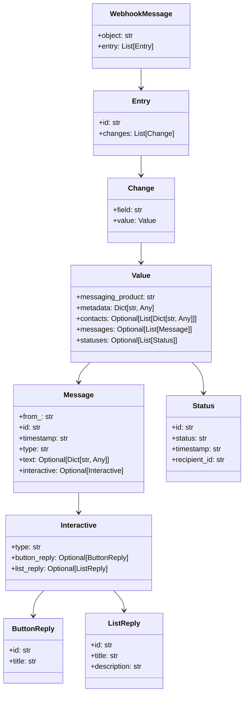

# WhatsApp Template

This repository serves as a robust template for building and handling WhatsApp Webhook integrations using the WhatsApp Cloud API. Below is a detailed breakdown of the folder structure, files, and functionalities.

---

## Table of Contents

1. [Folder Structure](#folder-structure)
2. [Webhook Schema](#webhook-schema)
3. [Message Handler Flow](#message-handler-flow)
4. [WhatsApp Services](#whatsapp-services)
5. [How to Run the Server](#how-to-run-the-server)

---

## Folder Structure

The repository is organized into logical folders to separate concerns and ensure scalability:

```bash
WHATSAPP_TEMPLATE/
├── src/
│   ├── config/             # Configuration files for environment variables
│   │   ├── env.py
│   ├── controllers/        # Controllers to handle incoming webhooks
│   │   ├── webhook_controller.py
│   ├── routes/             # HTTP route definitions
│   │   ├── webhook_routes.py
│   ├── schemas/            # Pydantic schemas for webhook validation
│   │   ├── webhook_schema.py
│   ├── services/           # Service layer for business logic
│   │   ├── airtable_service.py
│   │   ├── message_handler.py
│   │   ├── open_ai_service.py
│   │   ├── whatsapp_service.py
│   ├── utils/              # Utility functions and logging
│       ├── logger.py
├── watch.py                # Server initializer using Grok for public-facing webhook testing
├── .env-example            # Example environment variable file
└── README.md               # Documentation (you're reading this now)
```

### File Descriptions

| **File/Folder**              | **Purpose**                                                                                  |
|-------------------------------|----------------------------------------------------------------------------------------------|
| `config/env.py`              | Manages environment variables like API keys and configurations.                             |
| `controllers/webhook_controller.py` | Handles webhook payloads from WhatsApp and routes them to services.                             |
| `routes/webhook_routes.py`   | Defines HTTP routes for webhook endpoints.                                                  |
| `schemas/webhook_schema.py`  | Contains Pydantic models to validate incoming webhook messages.                             |
| `services/airtable_service.py` | Manages interaction with Airtable for data storage.                                        |
| `services/message_handler.py`| Handles the core business logic and message workflows for WhatsApp interactions.            |
| `services/open_ai_service.py`| Integrates with OpenAI's GPT for conversational AI workflows.                               |
| `services/whatsapp_service.py`| Provides utilities to interact with the WhatsApp Cloud API (e.g., send messages, buttons). |
| `utils/logger.py`            | Implements logging for debugging and monitoring.                                            |
| `watch.py`                   | Initializes the server and enables Grok for exposing the local server to the public.        |

---

## Webhook Schema

The `webhook_schema.py` file defines the structure of the incoming webhook payload using Pydantic models. This ensures that all incoming data adheres to the expected format, avoiding runtime errors.

Here’s the UML diagram for the schema:


## Example Usage

The schema provides a robust way to parse and validate incoming messages:

```python
from schemas.webhook_schema import WebhookMessage

# Parse and validate incoming payload
data = WebhookMessage.parse_obj(incoming_payload)
print(data.entry[0].changes[0].value.messages[0].text)
```

# Message Handler Flow

The `message_handler.py` file contains the main logic for handling incoming webhook messages. It defines flows for registration, AI interactions, and more.

## Example Flow: User Registration

1. **Start Registration**: If the user selects "Register," the handler begins by asking for their full name.
2. **Validate Inputs**: Each step validates user input and moves to the next step.
3. **Completion**: After collecting all details, the data is stored in Airtable, and the user is welcomed.

## Key Methods

- `process_message(data: dict)`: Central dispatcher for handling incoming messages.
- `handle_user_register_flow(to: str, message: dict)`: Manages the registration workflow.
- `handle_ai_conversation(sender_id: str, message: dict)`: Manages conversations powered by OpenAI.

---

# WhatsApp Services

The `whatsapp_service.py` file provides helper functions to interact with the WhatsApp Cloud API, such as sending messages, media, and interactive menus.

## Features

- **Send Text Messages**: `send_message(to: str, body: str)`
- **Interactive Buttons**: `send_buttons_menu(to: str, body: str, buttons: list)`
- **List Menus**: `send_list_menu(to: str, body: str, sections: list)`
- **Media Sharing**: `send_media(to: str, media_type: MediaType, media: str)`


## Example

```python
from services.whatsapp_service import WhatsAppService

# Send a text message
await WhatsAppService.send_message(to="+1234567890", body="Hello from WhatsApp Bot!")
```

---

## How to Run the Server

### Step 1: Set Up Environment Variables

Copy `.env-example` to `.env` and update the values:

```plaintext
WP_ACCESS_TOKEN=<your-whatsapp-token>
WP_PHONE_ID=<your-whatsapp-phone-id>
API_VERSION=v13.0
```

### Step 2: Start the Server

Use the `watch.py` script to start the server:

```bash
python watch.py
```

### Step 3: Expose the Server with Ngrok

Install Ngrok and expose the server to the public for testing:

```bash
ngrok http 5000
```

Your webhook URL will look like:

```
https://<ngrok-url>/webhook
```

### Step 4: How to properly stop the server

```bash
sudo lsof -i :5000
```
This will show you the process id of the server.

```bash
uvicorn   12345   user   22u  IPv4  1234567      0t0  TCP *:5000 (LISTEN)
```
Kill the server with:

```bash
kill -9 <process-id>
```
